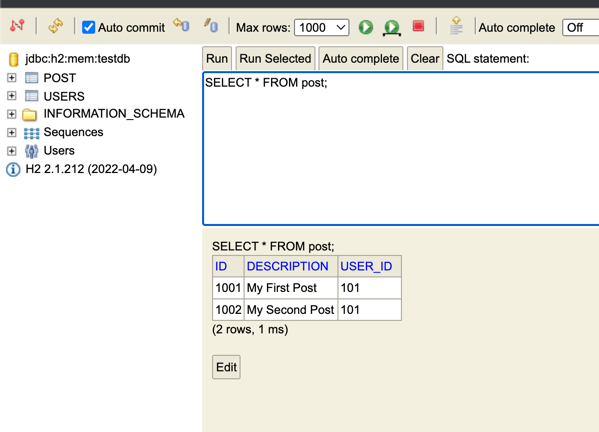
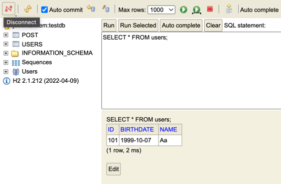

### Creating User Entity and Test Data
- Make the User an Entity
- Make the ID generated value and primary key

#### TABLE STRUCTURE (from User class)
create table user (
    id integer not null, 
    birthdate date, 
    name varchar(255), 
    primary key (id)
)

- To populate the table with some data, create a sql file inside the "resources" folder
- Create a new class that will serve as our controller "UserJPAResourceController"
- Create a repository interface that will extend JpaRepository, this class will be Autowired in our controller class

### Creating Post Entity and Many-to-One Relationship with User Entity
- Retrieve all Users
- Create a User
- Retrieve one User
- Delete a User

- Retrieve all posts for a User   - GET /user/{id}/posts
- Create a posts for a User       - POST /user/{id}/posts
- Retrieve details of a post      - GET /users/{id}/posts/{post_id}

- "user" has many-to-one relationship with "post"
- FetchType.Lazy will not get the info about the user, unless you called Post.getUser()
- MappedBy -> only works for @OneToMany annotation

